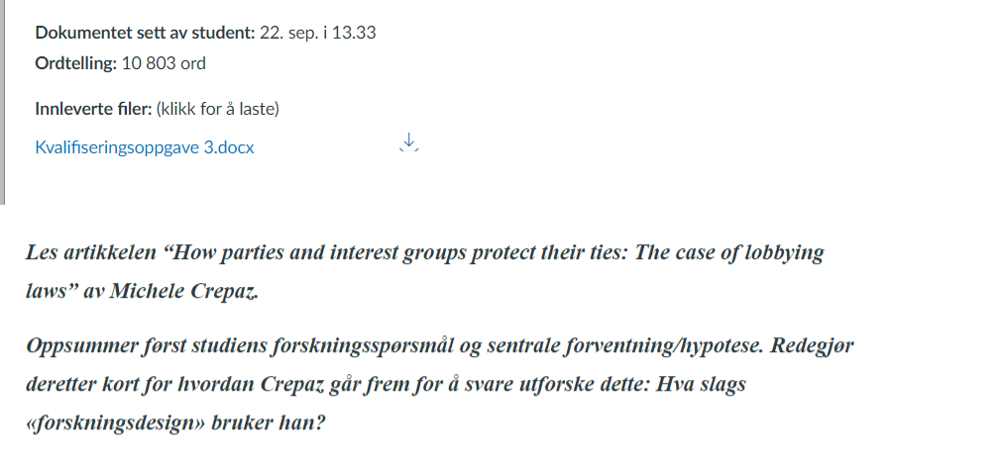
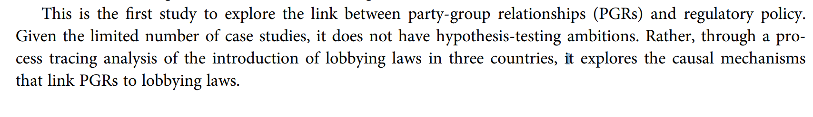
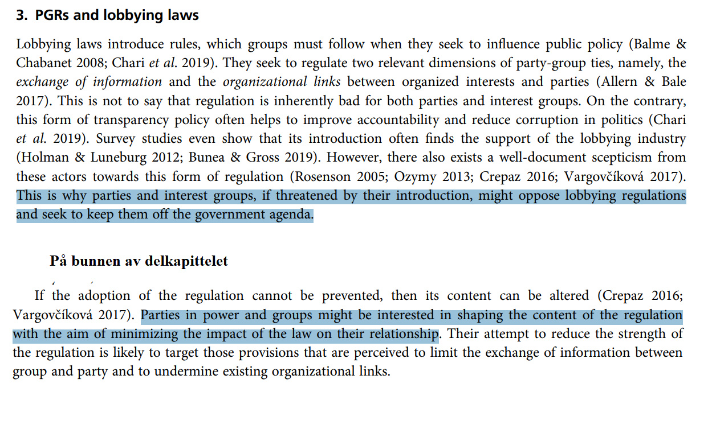
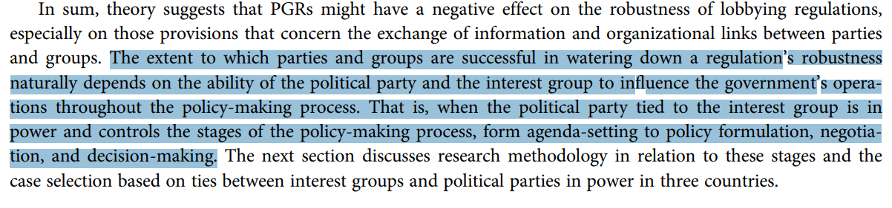

## Som etterspurt, her er artikkel om prosessporing

- https://doi.org/10.1080/09636412.2015.1036610

## Etter lang ventetid er den endelig her...

## Forbedret Presentasjon!

## Vi opererer nå i 2D

- Med mindre du leser dette i etterkant av seminaret...
- PDF mulighetene er ikke like fancy desverre 

## Forhåpentligvis blir veien til neste gang litt bedre

```{r, echo=FALSE}
knitr::include_graphics("presImg/css_meme.png")
```


## Planen for i dag

- Dere kan den nå
- Vi diskuterer oppgaven
  - Jeg sier noe (forhåpentligvis) nyttig om temaet
- Åpen spørretid
- Pause
- Gruppeoppgave

## Temaet i dag er Forskningsdesign

- I dag ser vi på hypoteser/forventninger
<br> <br>
- Disse kommer fra tidligere teoretiske bidrag
  - Hva har andre funnet om liknende tilfeller
- Husk at disse skal gi mening i henhold til forskningsspørsmålet

## Kvalifiseringsoppgaven

- Les artikkelen “How parties and interest groups protect their ties: The case of lobbying laws” av Michele Crepaz. 
<br> <br> 
- Oppsummer først studiens forskningsspørsmål og sentrale forventning/hypotese. Redegjør deretter kort for hvordan Crepaz går frem for å svare utforske dette: Hva slags «forskningsdesign» bruker han?

## Generell tilbakemelding 

```{r, echo=FALSE}

```

## Generell tilbakemelding

- Hva var bra?
  - De fleste hadde fått med seg nært alle punktene om forskningsdesign
- Hva manglet ofte?
  - Det vanligste var at problemstilling og tema ble forvirret
  - Men mange forvirret også det mer generaliserte funnet som en forventning
- Hva kunne vært enda bedre?
  - Separere de to hypotesene
  - Vise forståelse for hvordan de er sammenhengende

## Løsningsforslag

- Forskningsspørsmålet er "Hvordan påvirker forholdet mellom partier og interessegrupper lovgivning som søker å regulere disse forholdene?"
  - En liten munnfull ja
- Tittelen virker til å hinte om at det handler om "Hvorfor overlever disse båndene?"
  - Men som teorien forklarer er det tydelig at de overlever uansett, spørsmålet er hvordan forholdet påvirker lovgivingen. 
- Det er også et fokus på *styrken* til disse båndene. 

## Løsningsforslag

- Sentrale hypoteser: 
  - Eksistensen av sterkere parti-gruppe bånd leder til en "utvanning" av lovgivning som regulerer lobbyvirksomhet
  - Effekten vil være avhengig av om det politiske partiet har regjeringsmakt eller ikke.
    - Men også om de kontrollerer viktige deler av beslutningsprosessen
    - agendasetting til beslutningstakning
<br> <br>
- Forskningsdesignet:
  - Komparativt case studie, med 3 land
  - Prosess-sporing

## Hva handlet alt dette om?

- Det viktige her var å få med seg hypoteser og forskningsspørsmålet
- Hypoteser er det vi forventer
  - Kommer oftest fra teorier
  - Hva har tidligere forskning funnet på liknende områder?
  - Og hvorfor har jeg grunn til å tro at de er gjeldende her?

## Hvor skulle man funnet dette?

- Artikkelen er strukturert litt merkelig til tider
- Men som ventet kommer selve forskningsspørsmålet på slutten
  - Eller i alle fall hintet om dette spørsmålet
- Vi er litt tilbake til forskningsvasen her

## Hvor skulle man funnet dette?

```{r, echo=FALSE}

```

## Hvordan er denne artikkelen strukturert?

- Seksjonene er åpenbart ikke helt som jeg poengterte
- Dette er vanlig dessverre.. 
- Introduksjonen er veldig lang, og mye av det viktige blir poengtert der
- "Teori" kapittelet er å finne under del 2 og 3
  - Seksjon 2 har mye med å forklare det generelle rammeverket forfatteren bruker
  - Seksjon 3 har mer med de faktiske forventningene å gjøre
  
## Forventningene

```{r, echo=FALSE}

```

## Forventningene

```{r}

```

## Til slutt, forskningsdesignet

- Finnes i seksjon 4
- Sier veldig tydelig hva det overordnede designet er
- Hva slags metode som brukes
- Komparativ Case-studie, tre land, prosess-sporing
- Kvalitativt

## Åpen spørretid

- Har noen møtt på noen problemer som de ønsker å dele?

## Gruppediskusjon

- Aller først, kom på noen årsaksspørsmål i statsvitenskap

## Gruppediskusjon

Hva slags generelt «forskningsdesign» ville du valgt for å studere dette/disse spørsmålene? Mange enheter (N) eller få/ett (casestudie)? Data fra ett tidspunkt, eller over tid? Og hvorfor? Eller en miks? Hvilke muligheter og begrensninger har de ulike designalternativene?

## Gitt ingen forslag

Påvirker regimetype sjansen for om en stat involveres i krig og i tilfelle hvorfor? Ifølge teorien om «demokratisk fred» («democratic peace») tenderer demokratier til å unngå krig med hverandre. Mulige årsaker er at demokratiske institusjoner begrenser politiske lederes handlingsrom og/eller at borgerne i demokratier tenderer til å foretrekke fredelige løsninger på mellomstatlige konflikter.

## Gitt ingen forslag

Hva gjør at enkelte land har lave nivåer av kvinnelig representasjon? Noen mener at det har med valgssystemer å gjøre, mens andre sier at det har med lange tradisjoner med dominans av maskuline trekk i rekrutteringsløpet. 

## Neste kvalifiseringsoppgave

Les artikkelen “The complementarity advantage: parties, representativeness and newcomers' access to power” av Karen Celis og Silvia Erzeel. Fokuser på artikkelens generelle forskningsdesign: hva er analyseenhet og hvordan har forskerne valgt ut «case»? Og hva slags data baserer de seg på? Bruk definisjonene fra forelesning: med «case» mener vi her ikke landene i studien selv om disse benevnes som «case». Et tips er å starte med å se på artikkelens hypoteser.

## Som alltid

- Lever i tide!
- Ta med godt humør!!
- Takk for i dag!!!