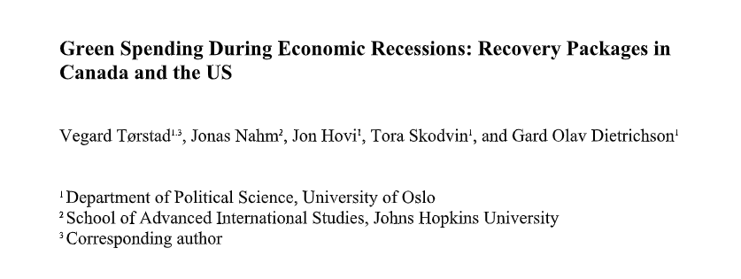

```{r setup, include=FALSE}
knitr::opts_chunk$set(echo = TRUE)
```

# Plan for i dag

- Gjennomgå oppgaven
  - Tilbakemelding
  - Løsningsforslag
  - Litt nærmere om intervju typer
- Åpen spørretid
- Pause
- Gruppeaktivitet

# Litt info

- Den lengre kvalifiseringsoppgaven har nå blitt lagt ut
- Leveringsfrist er likt de andre oppgavene, to virkedager før seminaret i uke 46
- Fristen er da mellom 10. og 16. November for alle gruppene
- Beskrivelse av oppgaven ligger ute på Canvas

# Temaet for i dag er Intervjuer

- Hovedtypen "kvalitative" forsknignsmetode som læres her
- Er delvis en praktisk metode, men gir også føringer på analysen
<br> <br>
- Kan brukes både i deduktiv og induktiv forskning
  - Men formen for denne intervju kan være avhengig av hva man vil med opplegget

# Kvalifiseringsoppgaven

Denne oppgaven handler intervju som datainnsamlingsmetode. Tenk deg at du skal studere norske interesseorganisasjoners (fagforeninger, næringsorganisasjoner, miljøorganisasjoner etc.) involvering i stortingsvalget 2021. Problemstillingen er i hvilken grad organisasjonene tok del i valgkampen og forsøkte å påvirke valget. Dere bestemmer dere for å intervjue relevante personer i et utvalg organisasjoner. Målet er å kunne sammenligne ulike organisasjoners svar etterpå, men også å få kunnskap om hva de enkelte organisasjonene har foretatt seg i noe detalj.

## Kvalifiseringsoppgaven

Hvilken intervjutype (strukturert, semi-strukturert, ustrukturert) vil du si er best egnet for dette formålet? Og hvordan ville du teknisk sett gjennomført intervjuet? Begrunn svarene dine kort. Lag til slutt et forslag til åpningsspørsmål.

## Bonus diskusjon

- Noen spesielle hensyn dere ville gjort med tanke på utvalg?
- Hvem kan være nyttig å snakke med, mer spesifikt?

# Generell tilbakemelding

- Hva var bra?
  - Nesten alle gjorde veldige gode besvarelser

- Hva var dårlig?
  - Det som manglet var å svare på alle tre deler av spørsmålet
  - Og diskutere rundt alle aspektene

## Generell tilbakemelding

- Hva kunne vært enda bedre?
  - Ut over det nevnt i forrige bilde, ikke mye...
  - Noen kunne hatt bedre åpningsspørsmål, og reflektert litt bedre rundt sitt valg av spørsmål
    - Men det er ikke noe som er lett å lære bort

# Løsningsforslag

- Oppgaven leder tydelig an til at man skal snakke om semi-strukturerte
  - Både sammenliknbart og belysende om den unike enheten
  - Vi ønsker nettopp denne formen
- Gullstandarden for gjennomføring av et intervju er ansikt-til-ansikt
- Åpningsspørsmålet er litt opp til dere
  - Et forslag: "Hvor lenge har du jobbet i organisasjon X"
  - "Hva er dine ansvarsområder innenfor organisasjon X"
- Det viktigste er også å reflektere rundt valgene, hvorfor dette, og hvorfor ikke dette andre

# Litt nærmere om Intervjuer

- Ukas oppgave har tre punkter som det kan være verdt å snakke litt nærmere om
<br> <br>
- Hva slags intervju?
- Hvordan gjennomføre det?
- Hvordan åpne det?

## Hva slags intervju

- Som oppgaven sier har vi tre typer intervjuer vi forholder oss til
  - Alle har sin plass i forskning
<br> <br>
- Strukturerte passer godt til statistisk forskning
  - Anvendes ofte som store datasett
  - Eksempel: ESS, WVS, Asian Barometer Survey
  - Kan lettere anvendes på mange enheter
- Ustrukturerte er ofte en essensiell del av feltarbeid
  - Ofte nyttig for teorigenerering
  - Man går gjerne inn med veldig store spørsmål

## Hva slags intervju

- Semi-strukturerte er gode for å sammenlikne på lavt antall enheter
  - Gir mye av fordelene til strukturert
  - Men ikke like lett å oppskalere 

## Hvordan gjennomføre intervjuet

- Ansikt-til-ansikt er det mest ønskelige
  - Lettere å bygge "rapport"
  - Lettere å lese kroppspråk
  - Gir generelt bedre grunnlag for samhandling med intervjuobjekt
- Andre alternativer kan være
  - Over zoom, nest-best løsning?
  - Skriftlig: Enquette/e-post
    - Store svakheter
  - Telefon: Bedre, men fortsatt manglende
  
## Hvordan gjennomføre intervjuet

- Fokusgrupper er også en mulighet
  - Eller gruppeintervjuer generelt
  
## Åpningsspørsmål

1. Introduksjon av intervjuet og etablere relasjon
2. Oppvarmingsdel: “ice-breaker” (lett spørsmål) <- Vi er her
3. Hoveddel med ulike typer spørsmål
4. Nedtrappingsedel (“cool-off”)
5. Avslutning (mulighet for tillegg, takk)

## Åpningsspørsmål

- Bør være lett å svare på
- Men bør også være relatert til det intervjuet handler om

# Eksempel: Intervjuer om krisepakker i USA og Canada

- I lys av et forskningsprosjekt som jeg har jobbet for, gjennomførte vi noen intervjuer

```{r, echo=FALSE}

```

## Eksempel: Åpningsspørsmål

*"For the Record: Could you please briefly state your professional role and tell us about your background with Canadian climate and environmental politics?"*

## Eksempel: Åpningsspørsmål

- Spørsmålet er lett, og gir objektet sjansen til å snakke om seg selv og sine erfaringer

## Eksempel: Faglig spørsmål

- In the wake of the COVID-19 economic downturn (Dec 2020), the Canadian government launched the so-called Net Zero Accelerator – a strategic innovation fund. Could you tell us a bit about the background and aims of this initiative?
  - Do you know which actors that proposed the establishment of the Net Zero Accelerator?
  - Who benefits from this fund?
  
## Eksempel: Faglig spørsmål

- Spør tydelig om noe konkret, men ber også om vurderinger fra intervjuobjektet
- Gir mulighet til å snakke på egenhånd

## Oppfølgingsspørsmål

- Fordelen med semi-strukturert er også at det blir mulig å stille oppfølgningsspørsmål
<br><br>
- Det var også relevant i dette intervjuet

# Til sutt, litt om GDPR 

- Dette reglementet (til noens irritasjon) har endret mye i henhold til forskning
- Forskningsetikk messig er det veldig viktig å få både eksplisitt og informert samtykke 
- Dette gir også føring på hvordan all data som lages skal lagres og hvem den kan deles med
  - Veldig viktig at dere ikke deler noen av "funnene" fra datainnsamlingen med meg

## Til slutt,

- Er det noen flere spørsmål til ukas oppgave/tematikk?

# Åpen spørretid

- Noe dere har møtt på den siste uken som dere lurer på?

# Gruppediskusjon

La oss si du/dere skal intervjue enkeltpersoner om deres erfaring med å være medlem av en høyreekstrem politisk organisasjon, og nærmere bestemt om hvor aktive de er og hvordan de oppfatter at sin lokale avdeling fungerer i ulike henseende. Dette kan være et sensitivt tema å snakke med utenforstående om. Hva ville du/dere gjort for å få intervjupersonene til å føle seg komfortable? Forsøk å skrive et par spørsmål som kan starte intervjuet og sørge for at isen brytes.

# Neste kvalifiseringsoppgave

Hva skiller deltakende observasjon fra andre datainnsamlingsmetoder (som survey, intervjuer og fokusgrupper)?
<br> <br>
Hva slags type forskningsspørsmål kan deltakende observasjon brukes til å belyse? Kan denne datainnsamlingsmetoden brukes til å teste teori/hypoteser? Begrunn svaret ditt kort.

# Til Neste Gang!

- Lever i tide!
- Ta med godt humør!!
- Takk for i dag!!!