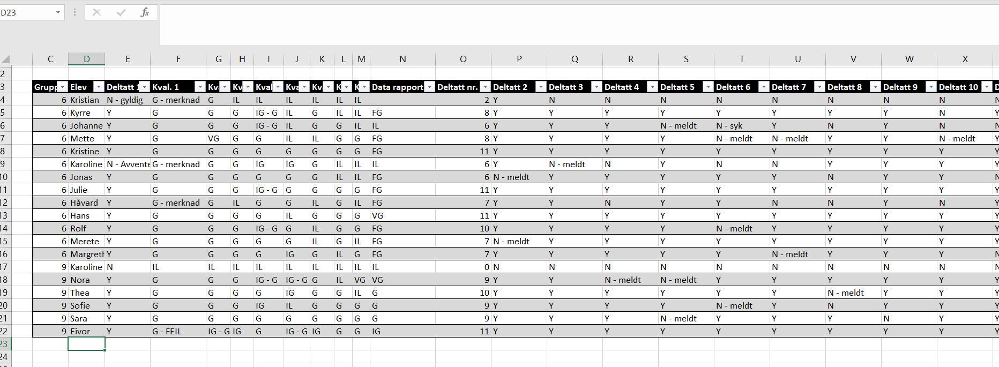

```{r setup, include=FALSE}
knitr::opts_chunk$set(echo = FALSE)
```

## Hva er planen?

- Vi går gjennom det generelle opplegget en gang til.
- Hva skal man gjøre på første seminar?
- Hvordan skal man organisere de videre seminarene?
- Erfaringer fra sist emnet ble holdt
- Oppsummering, tanker, veien videre

## Legg inn et kult bilde her

## Hva skjer i STV1010

- Seminarene er en læringsressurs for studentene
  - Hjelpe dem forstå pensum
  - Praktisk bruk av pensum
- "Avmystifisere" emnet
  - Studentene sliter ofte med forvirring rundt "hva handler dette om?"
- Være et sosialt knutepunkt

## Første Seminar

- Introdusere studentene til livet som student
- Start gjerne med å introdusere deg selv og dine "credentials"
- Her er det viktig at du lar studentene bli kjent med deg
- Si gjerne noe om hva du skriver/skrev Master om
- Poengter at du er fortsatt en **student** 
  - Du sitter ikke med alle svarene
  - Men du kan hjelpe dem langs veien til å finne dem
  
## Et Eksempel: Min slide fra i fjor

- Gard Olav Dietrichson (25)
- Fra Kolbotn
- Tok Bachelor her på instittutet med støtteemner i Sosiologi, går nå 3. semester på Masterprogrammet
- gardod@student.sv.uio.no

## Et Eksempel: Min slide fra i fjor

- Interesseområder
  - Hovedfokus på nasjonal politikk i:
    - Japan
    - Taiwan
    - Israel
  - Kvinnelig representasjon
  - Valgdesign
  - Rational Choice institusjonalisme
  - Diskursanalyse
  - Kulturanalyse
- Skriver Master om kjønnskvoter i MMM systemer

## Hvorfor?

- Disse introduksjonsmomentene gjør ofte studentene nysgjerrig på hva du driver med
- Gir gode muligheter til å bryte ned barrierer mellom seminarledere og student
- Vi er opptatt av et litt mindre formelt forhold mellom seminarleder og student

## Sette forventninger 

- Gjør tydelig hva du kan hjelpe med
- Men vær tydelig på at du ikke kan alt

## Eksempel Forventninger fra mine slides i fjor

- Jeg er åpen til spørsmål av alle slag, og dere kan sende en e-post på canvas eller på studentmailen min
- Jeg vil gjøre mitt beste for å være tilgjengelig fysisk mellom timene samt før og etter seminarene. 
- Men vær klar over at det kan hende jeg refererer dere til en annen plass
- Ikke se på meg som en _*absolutt*_ autoritetsfigur

- Har dere noen ting dere forventer av meg?

## Forventninger forts.

- Viktig å starte med hva de kan forvente av deg
- Gjøre det klart at du er der for dem
- Deretter poengter hva du forventer av dem

## Forventninger av Dere (Eksempel)

- Si ifra hvis dere ikke kan komme til seminaret
- Delta aktivt i diskusjonene 
  - Ha en viss grad av utviklingsmessig solidaritet
- Levere oppgaver i god tid

- Hva forventer dere av hverandre? 

## Ressurser dere bør gjøre dere kjent med

- Canvas

- Excel 
  - For godkjenningslister
  
- Power Point
  - Eller Rstudio hvis du er nerd
  
## Canvas

- For de med flere grupper, viktig å lære at du kan importere layouts
- Det finnes noen ferdige layouts som kan importeres, bruk gjerne noen av dem
- studentvisning kan la deg se ting før det publiseres

- Ukentlige leveringer lages i "oppgaver" mappen

- Formatter gjerne moduler eller liknende for å organisere arbeidet
- Om dere velger å laste opp alle slides er litt opp til dere selv

## Excel

- Mitt tips er å føre godkjenningslistene i Excel 
- Husk at oppmøte og kvalifiseringsoppgaver er del av kravet

```{r}

```


## Power Point

- Du kan finne powerpoint maler på UiO sin hjemmeside
  - Jeg kan ikke hjelpe med dem, siden de ikke funker for meg
  
- Jeg har en PP mal som dere gjerne kan bruke, sett i eksemplene
- Føl dere fri til å lære Beamer magi også

- Det viktigste er at dere har noe å gå på som gjør at presentasjonene ikke ser _for_ ille ut
- Viktig med et visst nivå at dekorum

## La oss ta en liten chat om første seminar gang

- Elin har lagt ut noen forslag til slides som bør være med
- Samt bulletpoints til alle poengene sine
- Ta en titt, også blir vi enige om hva som er viktigst å ta med

## Planlegging 

-


## Slide with R Output

```{r cars, echo = TRUE}
summary(cars)
```

## Slide with Plot

```{r pressure}
plot(pressure)
```

