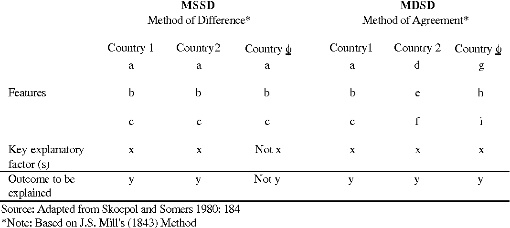

```{r setup, include=FALSE}
knitr::opts_chunk$set(echo = TRUE)
```

## Plan for i dag

- Gjennomgå oppgaven
  - Tilbakemelding
  - Løsningsforslag
  - Litt nærmere om casestudier og caseutvalg
- Åpen spørretid
- Pause
- Gruppeaktivitet

## Temaet for i dag er casestudier

- En form for forskningsdesign
- Brukes som regel i en kvalitativ forståelse
- Kan ha mange ulike formål, teorigenererende, hypotesetestende, etc. 

## Dette er en artikkel som ligger nært det jeg har studert

- Referensene er mange som går igjen i min egen Master
- Slik som Norris & Lovenduski (1995), Hughes (2014), Phillips (1999), etc.
- Hvis noen er interessert i andre aspekter ved feltet, si gjerne i fra

## Kvalifiseringsoppgaven

Les artikkelen “The complementarity advantage: parties, representativeness and newcomers' access to power” av Karen Celis og Silvia Erzeel. Fokuser på artikkelens generelle forskningsdesign: hva er analyseenhet og hvordan har forskerne valgt ut «case»? Og hva slags data baserer de seg på? Bruk definisjonene fra forelesning: med «case» mener vi her ikke landene i studien selv om disse benevnes som «case». Et tips er å starte med å se på artikkelens hypoteser.

## Generell tilbakemelding

- Hva var bra?
  - Case var det mange som hadde fått med seg riktig på
  - Analyseenhet var ofte nære
- Hva var dårlig?
  - Forholdet mellom analyseenhet og case var ikke alltid så godt presisgjort
    - Mange bommet på en, men traff (ish) på en annen
  - De fleste var også nære på analyseenhet
    - Men det er litt mer generelt enn bare Belgiske partier vedkommende prøver å si noe om

## Generell tilbakemelding

- Hva kunne vært enda bedre?
  - Forbedre struktur på hvordan case er utvalgt
  - Det er flere skritt involvert
  - Bruke begrepene relatert til casestudier
  - Hvorfor hver av de skrittene

## Løsningsforslag

- Analyseenhet er politiske partier
  - Det er nettopp atferden til disse enheten som forfatterne ønsker å forklare
  - *Hvorfor* velger partier å rekruttere så mange minoritetskvinner?
<br> <br>
- Casene er mer spesifikt da, de fire partiene som studeres
- De spesifikke casene velges ut i et ledd med innsnevringer
  - Det er Belgiske partier
  - Det er flemske Belgiske partier
  - Det er akkurat disse partiene
  - Belgia, Flandern, Fire partier

## Løsningsforslag

- Det er i stor grad snakk om typisk case utvalg
<br> <br>
- Dette gjelder i alle trinnene
  - Belgia er typisk, på grunn av ting som valgssystem
  - Flandern er nyttig fordi det har en vanlig partifamilie
  - Disse partiene representerer et bredt spektrum, og utgjør derfor *typiske* partier

## I dette tilfelle

- Legg mye fokus på seksjon 6
- "Diskusjon" seksjonen
  - Passende, da det er her man ofte diskuterer hvor "gjeldende" funnene er for andre tilfeller

## Litt nærmere om casestudier

- Vi kan starte med litt begrepsavklaring
  - Artikkelen sier "the case of Belgium"
  - Det er en vanlig forståelse av Case
    - og største kilden til ikke-godkjent i fjor
  <br> <br>
  - Case er *tilfelle* av **analyseenheten**

## Litt nærmere om casestudier

- Casestudier er:
  - Den intensive analysen (enten kvalitativ eller kvantitativ) av en enkel eller smått antall av enheter, der forskerens mål er å forstå en større klasse av enheter. 
  - Seawright & Gerring, 2008. 

## Litt nærmere om casestudier

- Vi har det som heter caseutvalgslogikk
  - casestudier gjør implisitt et valg om å studere enkelte tilfeller
  - Men dette utvalget må ha en god grunn, det må foreligge en god årsak til å se på akkurat *disse* tilfellene
- Her kommer hovedtypene inn

## Litt nærmere om casestudier

- Typisk
- Mangfoldig (diverse)
- Ekstreme
- Avvikende
- Innflytelsesrike
- MSSD
- MDSD

## Finnes også andre typologier

- Crucial
  - Most likely
  - Least likely
- Deviant

## Typisk

- Er et eksempel på et mer teorigenererende design
- Man finner frem tilfeller som man mener er "typiske" som avviker lite fra normale forhold
- Prøver å etablere en grunnleggende studie av hvorfor et fenomen skjer
- Når vi velger på variabler, kan dette hjelpe oss illustrere eller utforske mekanismer
- Mangfoldig casestudier faller litt under her
  - Demonstrere også at ikke alle bruker samme begrepsfamilie 

## MSSD og MDSD

- Er design som søker å **isolere** kausale årsaker
- Teoritestende 
- Beslektet til J. S. Mills metoder

```{r, echo=FALSE, out.width="60%"}

```


## Casestudier og generalisering

- Caselogikk legger føring på hva slags ekstern validitet du ønsker
- Motivasjonen for valg av en logikk er relatert hva du ønsker at casene dine skal bidra til den større verden med

## For mer om casestudier

- Les gjerne: 
  - J. S. Levy (2008), "Case Studies: Types, Designs, and Logics of Inference". 
    - Gir en grei innføring i design og slutninger
  - Seawright & Gerring (2008), "Case Selection Techniques in Case Study Research: A Menu of Qualitative and Quantitative Options".
    - Gir gode eksempler på utvalg

## Litt ekstra om analyseenheter på nytt

- Som vi har snakket om tidligere eksisterer analyseenheter på flere nivåer
- Siden case er tilfelle av analyseenheter er disse veldig sammenfallene
- Poenget med case er å belyse fakta og tilstander ved analyseenhetene
  - Teknisk sett er de observasjonene vi bruker i kvantitativ også "case" 
  - Men begrepet brukes sjeldent her
  
## Demonstrasjon av nivåer

- Sett inn et bilde her av analyseenhet nivåer

## Åpen spørretid

- Noe dere har møtt på den siste uken som dere lurer på?

## Gruppediskusjon

- Vi fortsetter med artikkelen til Celis og Erzeel
<br> <br>

- Fyll inn skrivet jeg deler ut
- Hva er:
  - Tema?
  - Forskningsspørsmål?
    - Videre, hva er argumentet de fører om tidligere forskning?
  - Hvilke teorier/hypoteser foreslår de?
  - Hva er artikkelens hovedargument?
  - Hva sier de om sitt undersøkelsesopplegg?

## Neste kvalifiseringsoppgave

Les artikkelen " The Islamic State’s Pattern of Sexual Violence: Ideology and Institutions, Policies and Practices” av Mara Redlich Revkin og Elisabeth Jean Wood.
<br> <br>
Velg ut to sentrale begreper/variabler i denne artikkelen og forklar hvordan de måles empirisk (dvs. er «operasjonalisert»).

## Til neste gang!

- Ta med godt humør!
- Lever i tide!!
- Takk for i dag!!!