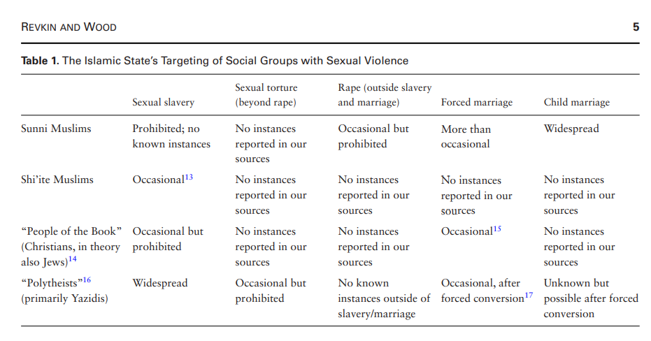
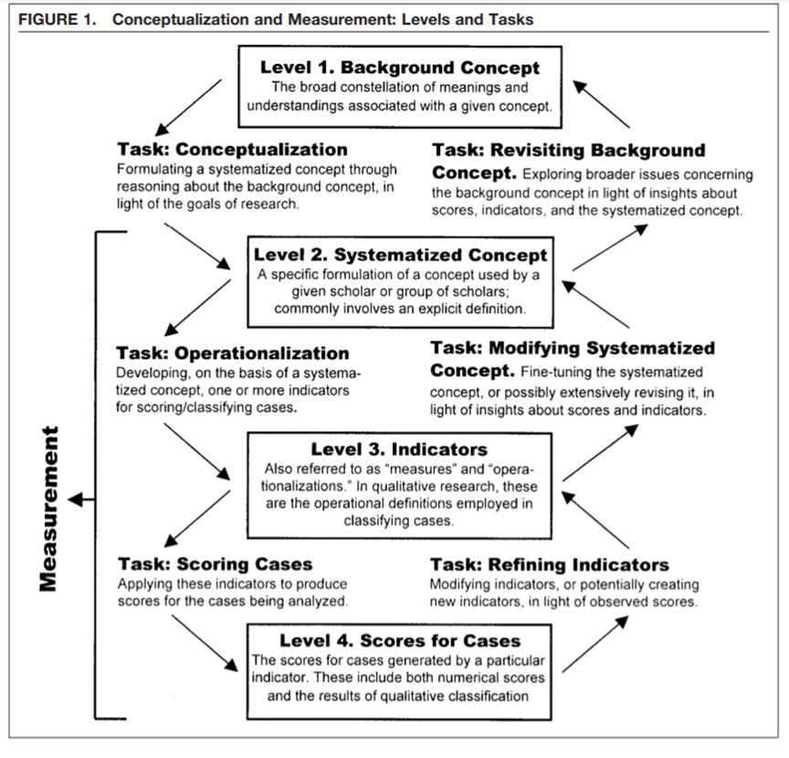

```{r setup, include=FALSE}
knitr::opts_chunk$set(echo = TRUE)
```

## Plan for i dag

- Gjennomgå oppgaven
  - Tilbakemelding
  - Løsningsforslag
  - Litt nærmere om operasjonaliseringer
- Åpen spørretid
- Pause
- Gruppeaktivitet

## Temaet for i dag er operasjonalisering

- En viktig del av forskning
- Legger til grunn hvordan vi skal gjennomføre hele prosjektet
- To essensielle aspekter ved det
  - Hvordan skal vi praktisk måle det
  - Hvordan skal vi forstå det/sammenlikne det

## Kvalifiseringsoppgaven

Les artikkelen " The Islamic State’s Pattern of Sexual Violence: Ideology and Institutions, Policies and Practices” av Mara Redlich Revkin og Elisabeth Jean Wood.
<br> <br>
Velg ut to sentrale begreper/variabler i denne artikkelen og forklar hvordan de måles empirisk (dvs. er «operasjonalisert»).

## Generell tilbakemelding

- Hva var bra?
  - Veldig mange hadde skjønt det flerdimensjonale aspektet ved voldsmønstre
  - Veldig mange hadde fått med seg ideologi som et annet begrep, og gitt gode forklaringer av det som lå nære teksten

- Hva var dårlig?
  - Noen hadde forvirret operasjonalisering, hva vi måler, med metode, hvordan vi henter det empiriske belegget

## Generell tilbakemelding

- Hva kunne vært enda bedre?
  - Ikke mye, men kanskje et bedre fokus på at uavhengig variabel var tilstedeværelse av ideologi i policyen til IS
  - Husk å se på forholdet mellom voldsmønster som det generelle, og seksuell vold som en instans av det

## Løsningsforslag

- Det er et hovedfokus på to variabler
  - Studien ser på sammenhengen mellom 
  - AV: "Patterns of Violence", gjerne mer spesifikt "Sexual violence"
  - UV: "Organizational policy" i tråd med ideologi
- Formålet er å bruke policy til å forklare mønstre i vold
  - Mønstrene er flerdimensjonelt forstått
  - Hvem er målet? Hva slags vold? Frekvens? Teknikk?
- Variablen "patterns of violence" blir da konstruert ut i fra de spesifikke observasjonene på de dimensjonene

## Løsningsforslag

- Forskningsopplegget i seg selv ser på følgende sammenheng
  - Er ideologi en viktig forklaring i IS' mønstre av voldsutøvelse
  - Dette kommer frem i offentlige skriv, de preskriberer organisasjonelle policy grunnet i organisasjonens ideologi
<br> <br>
- Voldsmønstre er multidimensjonelt og klassifiseres som en kombinasjon av:
  - Hvilke grupper? Hva slags vold? Frekvens og teknikk
  - Fokus på omfang av ulike typer seksualisert vold mot bestemte grupper 

## Løsningsforslag

- Under ulike typer seksualisert vold faller også under indikatorer, en type utdypning av denne indikatoren i dette tilfellet.
  - Seksuelt slaveri
  - Voldtekt
  - etc. 
- Den andre sentrale operasjonaliseringen, ideologi, og ideologien sin eksistens i operasjonel policy
  - Eksistensen av politikk uttrykt i offisielle dokumenter, som krever eller autoriserer under-mønstre av vold mot spesifikke grupper. 

## Løsningsforslag

```{r, echo=FALSE, out.width="65%"}

```

## Operasjonalisering

- Operasjonalisering er å utvikle indikatorer som reflekterer variabelen du er interessert i
- Gjør ting sammenliknbart på tvers av enheter
- Gjør forskningen praktisk gjennomførbar
  - Særlig når vi har med veldig abstrakte konsepter å gjøre

## Operasjonalisering

```{r, echo=FALSE, out.width="65%"}

```

## Operasjonalisering

- Suksessful operasjonalisering handler om validitet
  - Målevaliditet 
  - Styrker da intern validitet

- Klarer indikatorene å fange det abstrakte konseptet?
  - Vi snakket litt om sosial ulikhet for noen uker siden, hva kan være galt med å bare bruke inntektsulikhet?
  - Hva kan være bra med det?

## Operasjonalisering

- Den vanligste tabben på denne oppgaven er forståelig
- Operasjonalisering legger ofte føring på hvordan vi skal hente empirisk belegg
- Men operasjonalisering er en mer teoretisk øvelse

## Operasjonalisering: et eksempel

- Si at jeg ønsker å finne ut av hvordan opphavsted påvirker stemmegivning
- Virker relativt rett frem?
<br> <br>
- Hvordan skal jeg operasjonalisere opphavssted? 
  - Jeg kan åpenbart ikke bruke de nøyaktige koordinatene (eller kan jeg...)
  - Hvordan skal jeg gjøre det sammenliknbart?
  - Urban versus rural?
  - Dele opp i regioner?
  
## Operasjonalisering: et eksempel

- Hvordan skal jeg operasjonalisere stemmegivning? 
  - Bare hva vedkommende stemte? 
  - Jeg kan også lage færre kategorier
    - Populist vs mainstream?
    - Sosialist vs borgerlig?
    - Kanskje jeg har en ide om at rurale mennesker gir flere "opprørsstemmer"
<br> <br>
- Ideelt sett skulle vel spørsmålet mitt vært litt mer spisset

## Liten bonusoppgave

- Jeg ønsker å vite om kvinnelige representanter fokuserer mer på "kvinners problemer" (women's issues)
<br> <br>
- Hvordan skal jeg måle dette?
  - Hvordan operasjonaliserer jeg disse

## Til slutt...

- Er det noen flere spørsmål rundt ukas kvalifiseringsoppgave?

## Åpen spørretid

- Noe dere har møtt på den siste uken som dere lurer på?

## Gruppediskusjon

Begrepet «sosiale klasse» er omstridt, men står sentralt i mange sosiologiske og statsvitenskapelige studier, for eksempel i analyser av stemmegivning (partivalg): Er det slik at velgere fra bestemte sosiale klasser, har en tendens til å stemme på bestemte partier? For eksempel at «arbeiderklassen» tenderer til å stemme på venstrepartier (sosialdemokratiske/sosialistiske) framfor andre partier? «Sosial klasse» brukes også i dagligtalen, for eksempel i debatten om økonomisk ulikhet i samfunnet.

## Gruppediskusjon

- Hvordan ville du/dere definert «sosial klasse» om du/dere skulle forklart begrepet til noen? Tror du/dere det vil oppstå et problem med «concept stretching» (tøying av begreper) om definisjonen skulle fungere på tvers av land?
- Hvordan ville du/dere «operasjonalisert» definisjonen? Hva slags informasjon vil du/dere se etter for å kunne måle sosial klassetilhørighet blant velgere empirisk?

## Neste kvalifiseringsoppgave

Se for deg at du ønsker å gjennomføre en innholdsanalyse av hvordan sentrale nasjonale medier i Norge fremstiller debatten om formuesskatt. Studien er avgrenset til å dekke perioden fra 2013 til i dag, og radio og TV holdes utenom. Du har ikke ennå bestemt deg for om du vil gjennomføre en kvantitativ eller kvalitativ tekstanalyse, men er nødt til å basere deg på et utvalg av medier (færre en ti).
<br><br>
Hvilke kilder ville du brukt (hvilke aviser/nettsteder) og hvorfor?

## Til neste gang

- Lever i tide!
- Ta med godt humør!!
- Takk for i dag!!!