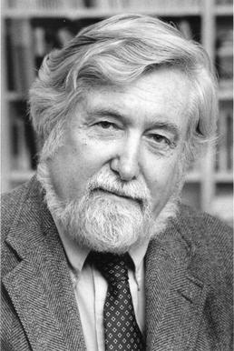

```{r setup, include=FALSE}
knitr::opts_chunk$set(echo = TRUE)
```

## Plan for i dag

- Gjennomgå oppgaven
  - Tilbakemelding
  - Løsningsforslag
  - Litt nærmere om deltakende observasjon
- Litt (forhåpentligvis) nyttig tips til lengre oppgave
- Åpen spørretid
- Pause
- Gruppeaktivitet

## Litt info

- Elin har lagt ut noen eksempel oppgaver på Canvas, som gir dere en pekepinn på hvordan eksamensspørsmål kan se ut
- Ut i fra disse, ser det litt ut som det ikke blir minuspoeng, men det vet nok Elin bedre

- Vi har også bestemt at siste frist for 2. forsøk på kvalifiseringsoppgaven vil være 26. November, 23:59

## Temaet for i dag er deltakende observasjon som metode

- Litt blandet med begrepet "etnografi"
  - Kommer av "å skrive om folk"
- Poenget er at forskeren selv er en del av det de ønsker å studere
- Kommer åpenbart med problemer

## Kvalifiseringsoppgaven

Hva skiller deltakende observasjon fra andre datainnsamlingsmetoder (som survey, intervjuer og fokusgrupper)?
<br> <br>
Hva slags type forskningsspørsmål kan deltakende observasjon brukes til å belyse? Kan denne datainnsamlingsmetoden brukes til å teste teori/hypoteser? Begrunn svaret ditt kort.

## Bonus Diskusjon

- Kan dere komme på noen av de største utfordringene med deltakende observasjon?

## Generell tilbakemelding

- Hva var bra?
  - Mange hadde en god beskrivelse av hva som kjennetegnet deltakende observasjon
- Hva var dårlig?
  - Mange var kanskje litt for optimistiske når det kommer til teoritesting
  - Men det kan argumenteres for at dette har med generelt vitenskapssyn å gjøre

## Generell tilbakemelding

- Hva kunne vært enda bedre?
  - Det jeg savnet mest var litt mer diskusjon rundt hvordan noe kan være teoritestende.
  - Hva slags bevis teller når vi tester teorier?
  - Hvordan tester vi dem?
  - Hvordan kan deltakende observasjon møte disse kravene?

## Løsningsforslag

- Deltakende observasjon handler om
  - Å studere folk i sanntid
  - Anskaffe førstehåndsinformasjon, om hva folk gjør, sier, og hvordan de samhandler
  - Å anskaffe "tykke beskrivelser" 
    - Begrep gjort kjent av Clifford Geertz 

## Løsningsforslag

- Teori-testing
<br> <br>
- Kan gjøre at vi kommer veldig nære mekanismer
- Men kan ikke strengt talt brukes til å teste generelle hypoteser
  - Men hvis vi trekker litt på innsikter fra case
  - Kanskje kan de fortsatt gi gode innsikter?
- Teori brukes gjerne aktivt uansett, for å danne noen typer forventninger

## Litt nærmere om deltakende observasjon

- Tolking av data krever ofte mye av forskeren
- Men også selve opplegget krever ekstra mye
- Boka skiller det inn i tre områder
  - Planlegging - Hva er det beste stedet? Hvordan komme seg dit?
  - Gjennomføring - Hvem snakker/følger du med? Hvorfor?
  - Transkribering - Hvordan skal du holde trett med all informasjonen?

## Problemer

- Veldig ofte vanskelig å opprettholde sin rolle som observatør
  - Intervjuereffekten som vi snakket om forrige uke kan komme tilbake her
- Hvordan ta notater av alle tanker som flyr gjennom hodet ditt?
  - Det du gjerne er ute etter, er *tykke beskrivelser*

## Litt mer om tykke beskrivelser 

- Anbefaler å ta en titt på Clifford Geertz sitt essay
```{r, echo=FALSE}

```

## Litt mer om tykke beskrivelser

Hva er forskjellen mellom en som blunker med ett øye (winking), og en som har rykninger (twitch)?

## Litt mer om tykke beskrivelser

Hva om en tredjeperson kommer inn, og gjør narr av den med rykninger, ved å herme etter den?

## Litt mer om tykke beskrivelser

- Det finnes altså fenomener som 
  - Ikke kan beskrives uten kontekst
  - Ikke kan abstraheres basert kun på den deskriptive virkeligheten
  - Som mister nærmest hele sin betydning, om fjernet fra kontekst
  
## Litt mer om tykke beskrivelser

- Nøkkelen til en vitenskapelig tilnærming handler om å forstå hva tegn, uttrykk og handlinger reflekterer, hvordan de reflekterer og bygger opp kultur, eller andre ting man er interessert i
- avdekke strukturene som former subjektene sine handlinger, og å konstruere et system av analyse som kan avdekke det som er unikt til strukturene vi analyserer, som vil stå ut i kontrast med andre forklaringer av oppførsel. 

## Litt mer om tykke beskrivelser

- *"Winks upon winks upon winks"*
- *"It's turtles all the way down"*

## Litt om et kjent tiflelle av deltakende observasjon

- Leon Festingers *When Prophecy Fails*

```{r, echo=FALSE, out.width="30%"}
knitr::include_graphics("presImg/festinger.jpg")
```

## For de som ikke er kjent 

- Festinger hørte om en dame som snakket med romvesner
- Hun forutså at verden kom til å ta slutt
- Men hennes følgere ville bli reddet
- Hva skjer når disse menneskene blir møtt med **bevis** på at de tar feil?


## Hvordan gikk de frem?

- De infiltrerte kulten deres
- Fem forskere (fra Festinger sitt team) som deltok
- Hemmelig observasjon (litt problematisk)
- Hemmeligheten gjorde forskningsbiten veldig vanskelig

## Hva skjedde?

- Dommedag kom åpenbart ikke...

## Men de virkelig store problemene

- Festinger sitt team har blitt anklaget for å faktisk forårsake utfallet
- I mange tilfeller var møter bestående av 33% forskere
- Drev de med vilje og "nudget" kulten i en særlig retning?

## Til slutt

- Er det noen spørsmål rundt ukas tematikk/oppgave?

## Litt om lengre kvalifiseringsoppgave

- Vil gjerne ta litt til tid til å snakke om to aspekter
<br> <br>
- Arbeidsprosessen
- Kildebruk

## Arbeidsprosessen

- Start med å lage intervju guiden
- Lag et lite ekstra ark til intervju guiden, der du forklarer hvorfor du tok med alle spørsmålene
- Gjør intervjuene
- Skriv rapport
  - Funket guiden? Oppfylte spørsmålene det du ville med dem?

## Intervju guiden

- Husk å ha med en generell introduksjon
- Samtykke avklaring
<br> <br>
- Få med oppvarmingsspørsmål
- Inkluder gjerne potensielle oppfølgningsspørsmål

## Gjør intervjuene

- Selve utførelsen er mye opp til dere selv
- Tenk litt over hvor dere vil gjennomføre det
- Gjør en beslutning på om dere vil ta notater i det hele tatt
  - Og hva dere vil notere

## Kildeføringer

- Valg av stil er opp til dere selv, men vær konsistente
- Vanligste er APA varianter
- Bruk sokogskriv aktivt
- Detaljer trenger ikke være 100% på plass
- Viktigste er: Hvem, Når, Hva, Hvor.

## Kildeføringer

```{r, echo=FALSE}
knitr::include_graphics("presImg/kilde.jpg")
```


## Kildeføringer 

- Etnografi er studiet av mennesker og deres handlinger i *sanntid* (Halperin & Heath, 2017)
- Halperin, S. & Heath, O. (2017). *Political Research: Methods and Practical Skills* (andre utgave). Oxford: Oxford University Press

## Kildeføringer

-  Hajnal (2001) demonstrates that experience with high profile politicians of minority status (in their case African Americans) is associated with a decreased negative perception of that minority’s ability to perform as a politician.
- Hajnal, Z. L. (2001). White Residents, Black Incumbents, and a declining racial divide. *American Political Science Review, Vol. 95, No. 3*, pp. 603-617. doi:10.1017/S0003055401003033


## Åpen spørretid

- Noe dere har møtt på den siste uken som dere lurer på?

## Gruppediskusjon

Generelt forskningsspørsmål: Hvordan bestemmer avisjournalister i Norge hvilke politiske saker de skal dekke før et valg? Og i hvilken grad gir de utenforstående, som partier og PR- byråer, mulighet til å påvirke sine prioriteringer?

## Gruppediskusjon

-Lag en plan for en etnografisk studie av dette som inkluderer følgende aspekter:
  - Hva slags og hvilket sted/miljø («site») skal studeres og hvorfor
  - Valg av informanter
  - Tilgang til stedet og «portvoktere»
  - Rollen til forskeren i felt og forholdet til informantene
  - Når og hvordan skal forskeren ta feltnotater?
  - Etiske spørsmål og evt. annet man vil nevne
  
## Neste gang

- Ingen kvalifiseringsoppgave
- Men vi vil snakke om den lengre kvalifiseringsoppgaven
- Gjør dere klar til å gi en liten statusoppdatering
- Forbered spørsmål, utfordringer eller erfaringer

## Takk for i dag!!!