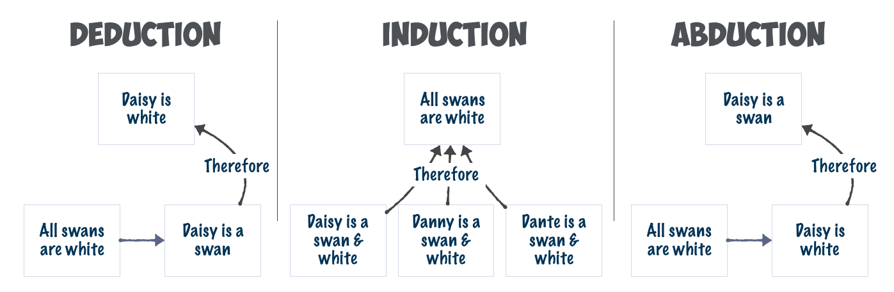

## Plan for i dag

- Diskutere ukas oppgave
  - Først i grupper
  - Så litt sammen
- Åpen spørretid
- Pause
- Gruppediskusjon

## Tema for i dag er Vitenskapsfilosofi generelt

## Kvalifiseringsoppgaven

Skru klokken 20 år tilbake, og anta at det er 2001, og at stortingsvalget nettopp har funnet sted. Valgdeltagelsen var 75,5%. Ved forrige stortingsvalg, i 1997, var valgdeltagelsen 78,3. En kommentator uttaler: "Vi ser at færre bruker stemmeretten nå enn tidligere i Norge. Valgdeltagelsen er nedadgående. Dette viser at folks misnøye med norske politikere i sin alminnelighet øker."

Hva slags slutninger trekker kommentatoren? Er det kommentatoren sier, velbegrunnet? Begrunn svarene dine kort.

Med valgdeltakelse menes andel av velgerne som avgir stemme ved valg. Du skal kun bruke informasjonen om valgdeltakelse i oppgaveteksten til å svare, ikke «fakta-sjekke» denne.

## Generell feedback 

Det er skummelt hvor mye av Malnes jeg kan lese i tekstene deres
<br> <br>
Jeg har lagt lista for å få godkjent litt lavt denne gangen.
<br> <br>
Jeg vil gjerne at dere ikke bruker tid på å gjenta spørsmålet

## Generell feedback

- Hva var bra?
  - Mange unike tanker om alternative forklaringer
  - Mange hadde fått med seg begrepsrammene 
- Hva manglet ofte?
  - Mange manglet å anvende det begrepsrammeverket fra Malnes
  - Men også de som brukte det, bommet ofte på hva slags slutninger
- Hva kunne vært enda bedre?
  - Spørsmål om utvalget av valg for å gjøre en generell slutning

## Mitt forslag/løsning

- To slutninger melder seg
  - En induktiv og en abduktiv
  - Tallene er mer premisser enn slutninger
<br> <br>
- Begge hviler på et svært svakt grunnlag
  - Induktive hviler på to datapunkt
  - Den abduktive kan godt være sann, men vi blir gitt liten god grunn til å tro det.

## Flere momenter

- Som mange har nevnt er det flere mulige alternative forklaringer som kan melde seg. 
  - Demografiske mønstre
  - Været
  - Kanskje folk er sånn middels fornøyde?
  - Alt mellom himmel og jord
- I tillegg ligger det noe i "i sin alminnelighet"
  - Er stortingsvalget representativt?
  
## Om slutninger

```{r, echo=FALSE}

```

## Slutningstyper 

- Generelt sett ser vi på tre former for slutningstyper
<br> <br>
- Deduksjon
  - Fastsatte lover, det følger naturlig av premissene
- Induksjon
  - Generalisering, slutning til en generell ting fra observasjoner
- Abduksjon
  - Slutning til beste forklaring

## Litt mer om argumentasjon

- Et argument kan være gyldig og forsvarlig (google translate)
<br> <br>
- Et argument er gyldig, hvis det følger av premissene
- Et argument er forsvarlig (sound) hvis premissene er sanne

## Et gyldig argument

- Alle franskmenn kan spille poker &nbsp;&nbsp;&nbsp;&nbsp;&nbsp;&nbsp;&nbsp;&nbsp;&nbsp;&nbsp;&nbsp;&nbsp;&nbsp;&nbsp;
- James Bond er Fransk
<hr>
- James Bond kan spille poker

## Litt mer om abduksjon, siden det er litt vanskelig

- "Slutning til beste mulige forklaring"
- Bygger egentlig på en haug med antakelser
- Merk at konklusjonen i en abduktiv slutning ikke er gitt å være sann
  - Men er (forhåpentligvis) mest sannsynlig

## Litt mer om abduksjon, siden det er litt vanskelig
```{r, echo=FALSE}

```

## Litt mer om abduksjon, siden det er litt vanskelig

- Formelt sett:
<br> <br>
- En vanlig person ringer om et IT problem
- De fleste vanlige personer er ikke gode med IT
- De fleste personer gjør lite forsøk på å fikse ting selv
- Derfor:
  - Vanlige personer ringer ofte om ting som er lette å løse
- Mye kan løses ved å skru PC'en av og på
<hr>
- Løsningen er å skru PC'en av og på

## Åpen spørretid

- Har dere noen spørsmål angående pensum?
- Noe relatert til en forelesning?

## Gruppediskusjon

All forskning i statsvitenskap stiller spørsmål om den sosiale verden, men det betyr ikke at alle forskere har samme tilnærming til forskning. Forskere har ulik forståelse av hva den sosiale virkeligheten er, hva vi kan vite om den og hvordan vi kan eller bør studere den. For å forstå andres forskning og planlegge vår egen, må vi kjenne til noen nøkkelbegreper og tilnærminger som samfunnsforskning bygger på.

Jobb i par/gruppe for å kople begrepene (termene) i notatet med definisjonene (ontologi, epistemologi, positivisme, interpretivisme, vitenskapelig realisme). Forstår du forskjellene, eller er det noe som er uklart med disse begrepene?

## Begrepene

- Positivisme
- Ontologi
- Epistemologi
- Vitenskapelig realisme
- Metodologi
- Interpretivisme

## Oppfølgningsspørsmål

1. Hvordan er ontologi og epistemologi forbundet?
2. Hvordan vil en «positivist» og en «interpretivist» være uenige om ontologi? Hva med epistemologi?

## Neste Kvalifiseringsoppgave

- Les sammendraget av Mark Aspinwall
<br> <br>
1. Hvilket og hva slags type forskningsspørsmål er det som stilles i denne studien? Bruk Halperin og Heath’s klassifisering når du svarer (deskriptivt spørsmål, årsakspørsmål, etc.).
2. Hvordan er spørsmålet avgrenset teoretisk/empirisk for å bli «forskbart»?
3. Beskriv så helt kort hva som er analyseenhet(er) og hva som er de sentrale variablene i denne studien.

## Til neste gang!

- Ta med godt humør :) 
- Husk å levere i tide
- Takk for i dag!!
